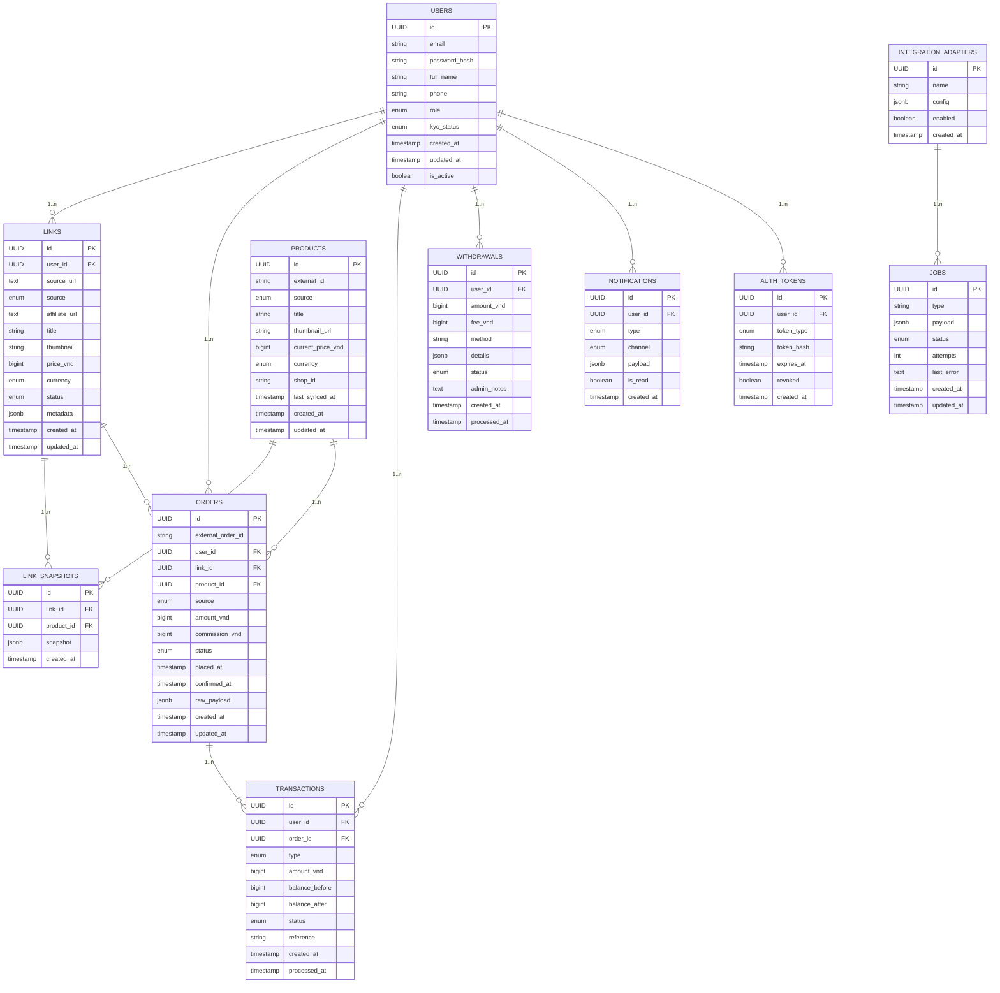

# ERD — Cashback Affiliate Platform (Mermaid)

Phiên bản: 1.0  
Ngày: 2026-07-28

Lưu ý: hệ thống ban đầu chỉ hỗ trợ Shopee. Tiền tệ mặc định: VND. Min withdrawal = 2.000 VND. Payout ban đầu xử lý thủ công.

Ghi chú:
- PK = primary key, FK = foreign key.
- Enums chi tiết và ràng buộc xem DATABASE_DESIGN.md.
- Ledger (transactions) là nguồn chân xác cho balance; balance có thể được tính từ tổng transactions confirmed hoặc lưu snapshot để tối ưu.
